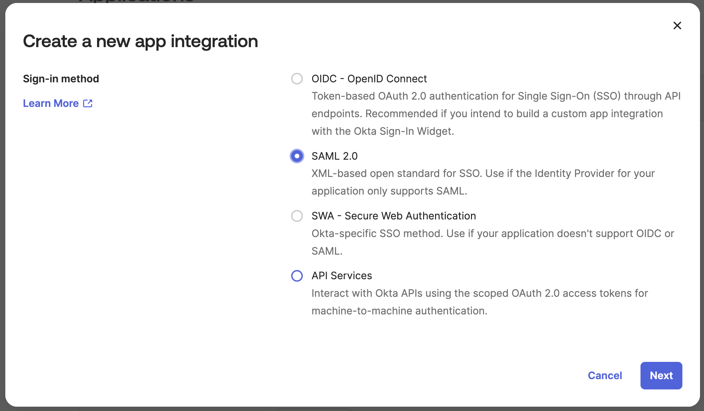
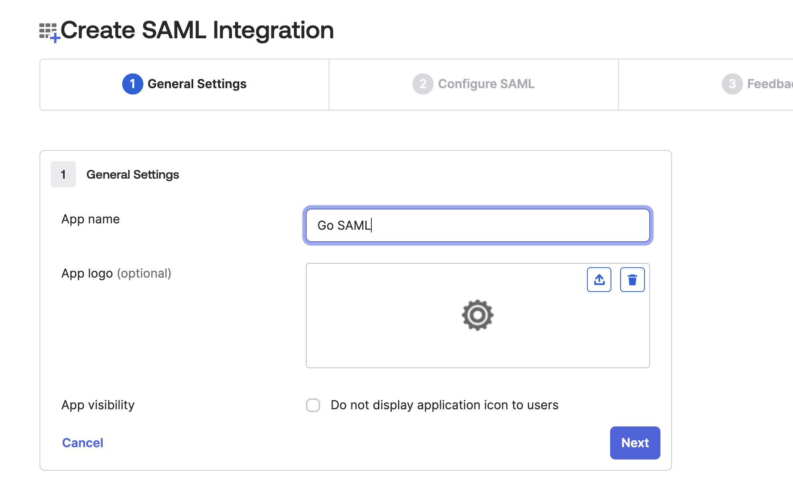
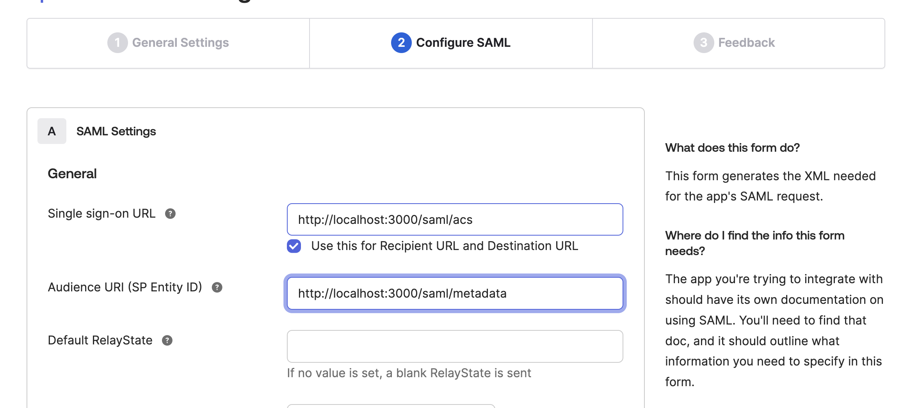
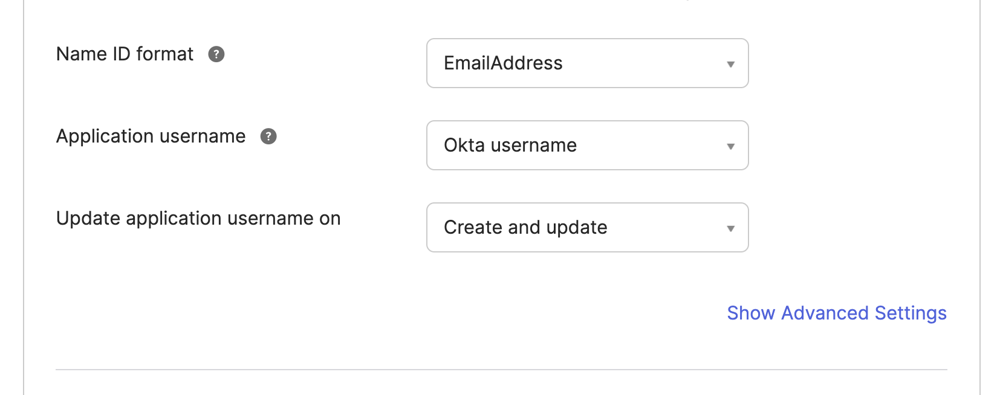
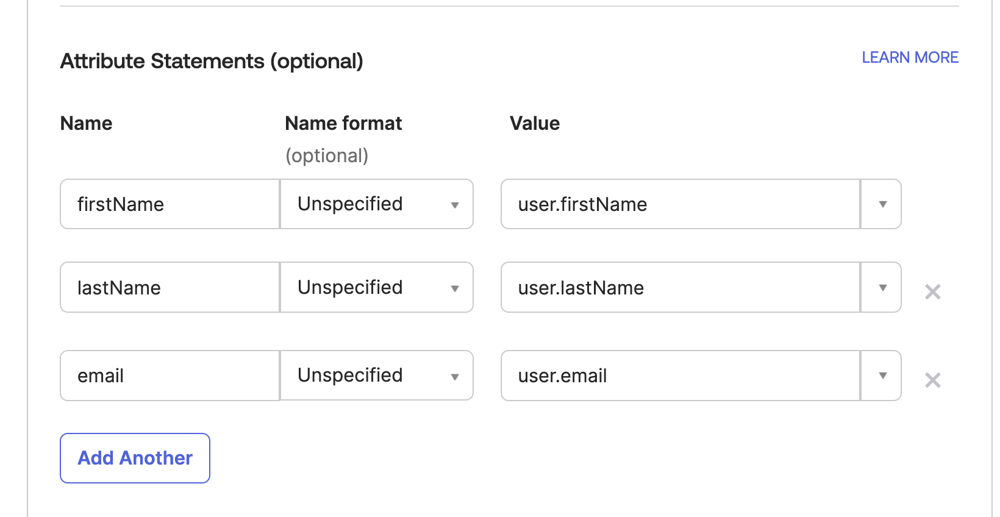

# Creating an SAML Okta Web App with Go
This is a tutorial for creating a server to integrat SPA's into Okta with SAML authentication. This assumes you have a production dist/ directory already. Move your dist/ folder into the root directory.

## Quick Start
Clone this repo, add your dist/ folder to the root directory and run the following commands after setting up your integration in Okta.

```sh
# Add environment variables
export ROOT_URL=http://localhost:3000
export IDP_METADATA_URL=<Okta Metadata URL>

# Create certs
./scripts/cert.sh

# Run the server
go run cmd/server.go
```

# Tutorial

## Step 1
Create an Okta SAML Integration with Okta admin
1. Open your Okta Admin dashboard, on the left pane select applications, create new integration
2. Create a SAML integration


3. Name your application


4. Set SSO URL and Audience URI with our local configuration


5. Set Name ID Format to EmailAddress


6. Set attribute statements


## Step 2
Add Environment variables
```sh
ROOT_URL=http://localhost:3000
IDP_METADATA_URL=<Okta Metadata URL>
```

## Step 3
Create ssl certs for the application.
```sh
openssl req -x509 -newkey rsa:2048 -keyout okta-app.key -out okta-app.cert -days 365 -nodes -subj "/CN=example.com"
```

## Step 4
Start building
Our final product will look like this:
```sh
.
├── cmd
│   └── server.go
├── go.mod
├── go.sum
├── pkg
│   ├── app
│   │   ├── api.go
│   │   ├── info.go
│   │   └── ui.go
│   └── core
│       ├── configs
│       │   └── configs.go
│       ├── middleware
│       │   └── saml.go
│       └── models
│           └── user.go
└── scripts
    └── cert.sh
```
Let's begin by setting up our project
### 4.1
```sh
mkdir okta_go_saml && cd okta_go_saml

go mod init github.com/<your github username>/okta_go_saml
```
### 4.2
Next, lay down the structure for our application.
```sh
mkdir cmd
mkdir pkg && cd pkg
mkdir app
mkdir core && cd core
mkdir configs
mkdir middleware
mkdir models
```
### 4.3
I like to start with the core directory, create the following files:
1. configs/configs.go
When we need any environment variables, we'll grab them from the configs package. Note these will use variables from a .env file if present in the root directory.
```go
package configs

import (
	"log"
	"os"

	"github.com/joho/godotenv"
)
func RootUrl() string {
	err := godotenv.Load()
	if err != nil {
		log.Println("No .env file found")
	}
	return os.Getenv("ROOT_URL")
}
func IdpMetadataUrl() string {
	err := godotenv.Load()
	if err != nil {
		log.Println("No .env file found")
	}
	return os.Getenv("IDP_METADATA_URL")
}
```
2. models/users.go
We'll create a model for Users for use in the frontend if needed. In our server, we'll grab the SAML assertion data (email, firstName, lastName that we added in Okta) marshal to JSON and send back to the client.
```go
package models

type User struct {
	Email     string `json:"email"`
	FirstName string `json:"firstName"`
	LastName  string `json:"lastName"`
}
```
3. middleware/saml.go
Here we set up the middleware that actually handles the SAML authentication. This is made simple with the library github.com/crewjam/saml/samlsp
```go
package middleware

import (
	"context"
	"crypto/rsa"
	"crypto/tls"
	"crypto/x509"
	"log"
	"net/http"
	"net/url"

	"github.com/crewjam/saml/samlsp"
	"github.com/eddique/okta_go_saml/pkg/core/configs"
)

func SamlMiddleware() (*samlsp.Middleware, error) {
    // Load our certs
	keyPair, err := tls.LoadX509KeyPair("okta-app.cert", "okta-app.key")
	if err != nil {
		log.Fatalln("Fatal Error:", err)
	}
    // Parse certificate to x509
	keyPair.Leaf, err = x509.ParseCertificate(keyPair.Certificate[0])
	if err != nil {
		log.Fatalln("Fatal Error:", err)
	}
    // Set the IDP metadata url
	idpMetadataURL, err := url.Parse(configs.IdpMetadataUrl())
	if err != nil {
		log.Fatalln("Fatal Error:", err)
	}
    // Fetch metadata on request
	idpMetadata, err := samlsp.FetchMetadata(context.Background(), http.DefaultClient,
		*idpMetadataURL)
	if err != nil {
		log.Fatalln("Fatal Error:", err)
	}
    // Set the apps root URL (http://localhost:3000 in this example)
	rootURL, err := url.Parse(configs.RootUrl())
	if err != nil {
		log.Fatalln("Fatal Error:", err)
	}
    // Create the SAML middleware
	samlSP, err := samlsp.New(samlsp.Options{
		URL:               *rootURL,
		Key:               keyPair.PrivateKey.(*rsa.PrivateKey),
		Certificate:       keyPair.Leaf,
		IDPMetadata:       idpMetadata,
		AllowIDPInitiated: true,
	})
	return samlSP, err
}
```

And run the following command:
```sh
go mod tidy
```
## Step 4.4
Create handlers for server endpoints. In okta_go_saml/pkg/app, create the following files:
1. app/api.go
Begin with a struct that will manage our endpoints and a simple health endpoint handler.
```go
package app

import (
	"net/http"
)

type ApiAdapter struct{}

func NewAPIAdapter() *ApiAdapter {
	return &ApiAdapter{}
}

func (api ApiAdapter) Health(w http.ResponseWriter, r *http.Request) {
	w.WriteHeader(http.StatusOK)
}
```
2. app/info.go
Our info handler to send user data from the SAML session to the client
```go
package app

import (
	"encoding/json"
	"log"
	"net/http"

	"github.com/crewjam/saml/samlsp"
	"github.com/eddique/okta_go_saml/pkg/core/models"
)

func (api *ApiAdapter) InfoHandler(w http.ResponseWriter, r *http.Request) {

    // Get user attributes from SAML session
	email := samlsp.AttributeFromContext(r.Context(), "email")
	firstName := samlsp.AttributeFromContext(r.Context(), "firstName")
	lastName := samlsp.AttributeFromContext(r.Context(), "lastName")

    // Create user struct
	user := models.User{
		Email:     email,
		FirstName: firstName,
		LastName:  lastName,
	}

    // Marshal struct to JSON
	jsonData, err := json.Marshal(user)
	if err != nil {
		log.Println("Error:", err)
		http.Error(w, "Internal Server Error", http.StatusInternalServerError)
		return
	}

	w.Header().Set("Content-Type", "application/json")
	w.WriteHeader(http.StatusOK)
    // Respond with user data
	w.Write(jsonData)
}
```
3. app/ui.go
Create a handler to serve our static dist/ folder
```go
package app

import (
	"net/http"
	"os"
)

func (api *ApiAdapter) FileServer(w http.ResponseWriter, r *http.Request) {
	path := "./dist" + r.URL.Path
	if _, err := os.Stat(path); os.IsNotExist(err) {
		http.ServeFile(w, r, "./dist/index.html")
	} else {
		http.ServeFile(w, r, path)
	}
}
```

## Step 4.5
Create the main function for our server. Create server.go in the cmd/ directory.
cmd/server.go
```go
package main

import (
	"log"
	"net/http"

	"github.com/eddique/okta_go_saml/pkg/app"
	"github.com/eddique/okta_go_saml/pkg/core/middleware"
	"github.com/gorilla/mux"
)

func main() {
	api := app.NewAPIAdapter()
	samlSP, err := middleware.SamlMiddleware()
	if err != nil {
		log.Fatalln(err)
	}

	router := mux.NewRouter()

	router.PathPrefix("/api/v1/whoami").HandlerFunc(api.InfoHandler)
	router.PathPrefix("/").Handler(http.HandlerFunc(api.FileServer))

	app := samlSP.RequireAccount(router)

	http.Handle("/", samlSP.RequireAccount(app))
	http.Handle("/saml/", samlSP)
	http.ListenAndServe(":3000", nil)
}
```
and run go mod tidy once more
```sh
go mod tidy
```
## Step 5
Run the server locally and access from the Okta application.
```sh
go run cmd/server.go
```